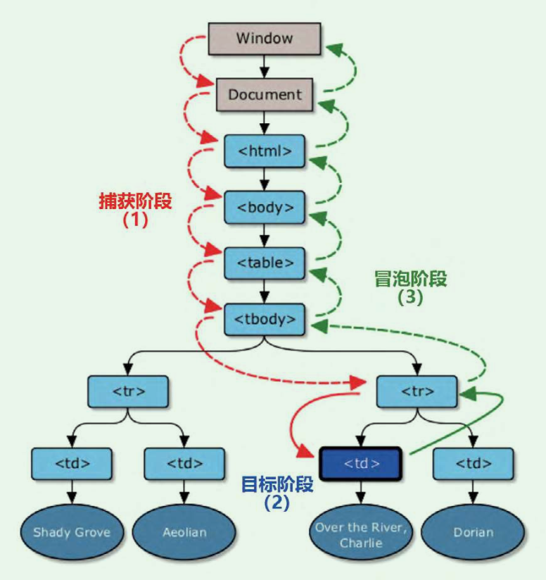
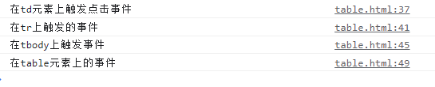
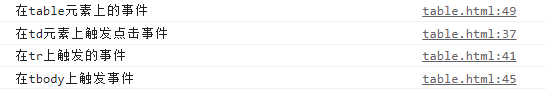
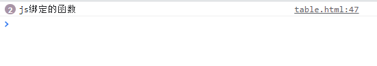
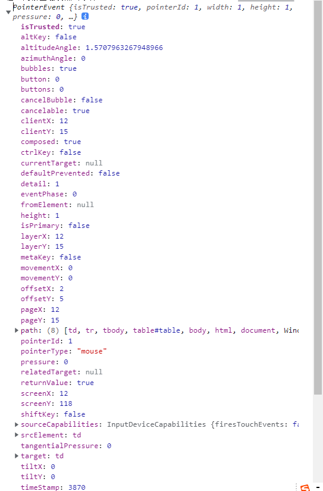
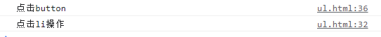
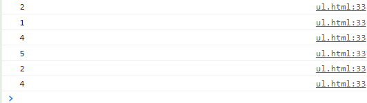

JavaScript和HTML的交互是通过事件来实现的，常见的事件就是鼠标点击事件，click事件、load事件mouseover事件等等，在事件触发时候，会执行绑定在元素上的事件处理程序。

事件流，就是描述从页面中接收到事件的顺序。事件在触发之后，会在目标节点和根节点之间按照一定的顺序在传播，经过的节点都会接收到事件。比如有一个table表格，分别在table表格、tbody、tr、td单元格上绑定click事件。

如果在td上触发点击事件，那么就会产生这样的事件流：

1. 事件传递顺序是先触发最外层的table元素，然后向里面传递，一次触发tbody、tr和td元素；
2. 事件传递顺序是从目标元素，也就是我们触发点击的td元素，向外传递，一次触发tr、tbody和table

第一个阶段是事件捕获型事件流，第二阶段是属于事件冒泡型事件流。那一个完整的事件流包含了事件捕获阶段、事件目标阶段和事件冒泡阶段

## 事件捕获阶段

事件捕获阶段是没有具体的节点接收事件，然后向下一层一层传播，具体的表现如图所示：



## 事件目标阶段

这表示事件刚好传播到用户产生行为的元素上，应该是事件捕获阶段的结尾，同时也是事件冒泡的开始

## 事件冒泡阶段

目标元素接收到事件后，一层一层向外传递。如上图所示。代码如下：

```javascript
<!DOCTYPE html>
<html lang="en">

<head>
    <meta charset="UTF-8">
    <meta http-equiv="X-UA-Compatible" content="IE=edge">
    <meta name="viewport" content="width=device-width, initial-scale=1.0">
    <title>Document</title>
</head>

<body>
    <table id="table">
        <tbody>
            <tr>
                <td>td</td>
            </tr>
        </tbody>
    </table>

    <script>
        const table = document.querySelector("table");
        const tbody = document.querySelector("tbody");
        const tr = document.querySelector("tr");
        const td = document.querySelector("td");


        td.addEventListener("click", function () {
            console.log("在td元素上触发点击事件")
        });

        tr.addEventListener("click", function () {
            console.log("在tr上触发的事件")
        })

        tbody.addEventListener("click", function () {
            console.log("在tbody上触发事件")
        })

        table.addEventListener("click",function(){
            console.log("在table元素上的事件")
        })

    </script>
</body>
```

当点击td元素的时候，结果如下：



这就事件冒泡现象。

## addEventListener函数

使用addEventListener函数绑定事件的话，默认第三个参数是false，也就是默认是按照冒泡事件来处理，上面的代码就是全部默认为冒泡事件类型处理。

如果第三个参数设置为true，那么就是在事件经过该节点的时候，这个事件是按照捕获型事件来处理，比如现在在table元素的事件上做一下修改：

```javascript
        table.addEventListener("click",function(){
            console.log("在table元素上的事件")
        },true)

```

这就是表示只接收捕获型的事件，



## 事件处理程序

事件处理程序就是把一个函数赋给一个事件处理属性，有两种方法：
1.通过JavaScript选择器获取元素后，再将函数赋值给对应的事件属性，比如

```javascript
        const tr = document.querySelector("tr");
        td.onclick = function () {
            console.log("td元素点击")
        }
```

2.直接在对应元素上设置事件属性，这个事件属性值有两种，一个执行的函数体，另一个是函数名，比如：

```javascript
    <button onclick="onclickBtn()">点击</button>
    <script>
        function onclickBtn() {
            console.log("td元素点击")
        }
    </script>
```

以上两种的事件处理程序属于DOM0级事件处理程序，有点是可以跨浏览器并且简单，缺点就是一个事件处理程序只能绑定一个函数，另外它只支持事件冒泡阶段。

一个处理程序只能绑定一个函数，比如在一个元素上事件属性，然后在JavaScript中给这个元素绑定另一个事件，代码：

```javascript
    <button onclick="onclickBtn()">点击</button>
        <script>
        function onclickBtn() {
            console.log("td元素点击")
        }

        const btn = document.querySelector("button");
        btn.onclick=()=>{
            console.log("js绑定的函数")
        }
    </script>
```

结果如图：



在JavaScript绑定的事件处理程序优先级高于在html元素中定义的事件处理程序。

## Event对象

事件在浏览器中是以Event对象的形式存在的，当一个事件被触发的时候，就会产生一个Event对象，这对象包含了所有参与事件的相关信息，包括事件的元素、事件的类型等等，比如：



根据不同交互场景，获取不同的属性。

## 阻止事件冒泡

有些场景，我们不需要事件冒泡，比如有一个ul容器，点击li元素，会修改li本身的样式，每一个li都有表示删除的button按钮，如：

```javascript
    <ul>
        <li>
            <p>姓名：读心</p>
            <p>编号：009</p>
            <button class="btn" id="btn">删除</button>
        </li>
    </ul>
    <script>
        const li = document.querySelector("li");
        const btn = document.querySelector("button");
        li.addEventListener("click",function(event){
            console.log("点击li操作");
        })

        btn.addEventListener("click",function(event){
            console.log("点击button")
        })
    </script>
```

当我们点击按钮的时候，由于冒泡事件的原因，事件冒泡到父元素上，所以两个事件同时触发



要避免这样的现象，就要在btn上的设置阻止事件冒泡：

```javascript
        btn.addEventListener("click", function (event) {
            event.stopPropagation();
            console.log("点击button")
        })
```

## 事件委托

事件委托就是利用事件冒泡的原理来管理某一个类型的所有事件，利用父元素来代表子元素的某一个类型的事件，比如：

```html
<!DOCTYPE html>
<html lang="en">

<head>
    <meta charset="UTF-8">
    <meta http-equiv="X-UA-Compatible" content="IE=edge">
    <meta name="viewport" content="width=device-width, initial-scale=1.0">
    <title>Document</title>
</head>

<body>
    <ul>
        <li>1 </li>
        <li>2 </li>
        <li>3 </li>
        <li>4 </li>
        <li>5</li>
    </ul>
    <script>
        const li = document.querySelectorAll("li");
        for (let index = 0; index < li.length; index++) {
            const element = li[index];
            element.addEventListener("click", function (event) {
            console.log("点击li操作",this.innerText);
        })
        }        
    </script>
</body>

</html>
```

这样的处理方式很消耗性能，如果有100个li元素，那么就是绑定了100个事件，事件处理需要不断的和DOM进行交互，这样导致浏览器重绘和重排的次数也会增加，会延长页面的交互时间。

事件委托就是把事件绑定到父元素上，然后利用事件冒泡原理，当事件进入冒泡阶段时候，通过绑定在父元素上的事件对象来判断当前事件流正在进行的元素：

```javascript
        const parent = document.querySelector("ul");
        parent.addEventListener("click", function (event) {
            //获取事件对象
            if (event.target.nodeName.toLowerCase() === 'li') {
                console.log(event.target.innerText)
            }
        })
```



这就是JavaScript事件！
