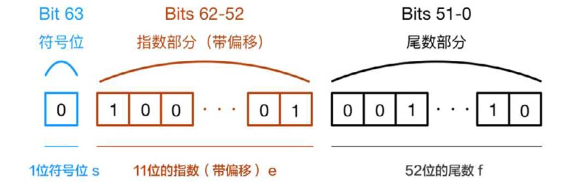
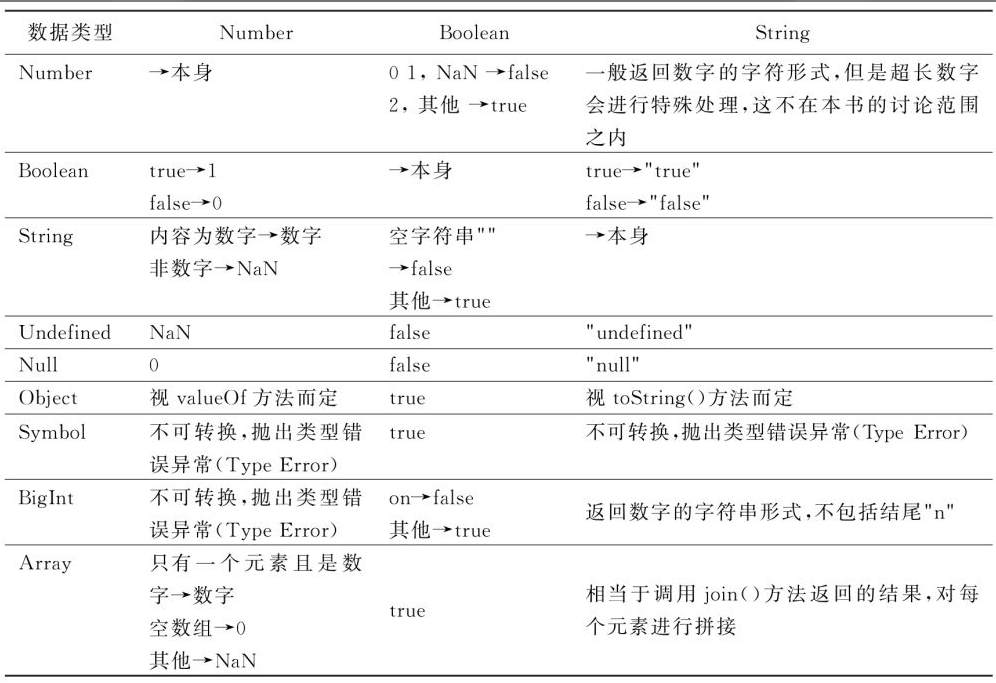

JavaScript中有8种数据类型，其中，7种数据类型，分别是Number、Boolean、String、Null、Undefined、Symbol、BigInt；引用数据类型为Object。

Object是结构化的类型，它是由多种数据类型组成的，另外JavaScript内置的Array、Map、WeakMap、Set、WeakSet等等都是属于Object类型的。

### typeof

JavaScript提供的typeof方法，用来判断基本的数据类型，比如：

```js
     typeof 5;                //＂number＂
     typeof true;             //＂boolean＂
     let str=＂hello＂;
     typeof str;              //＂string＂
     typeof{prop:＂value＂};  //＂object＂
     typeof function(){};     //＂function＂
```

但是typeof不能用来判断基本数据类型中的null，会返回object，这是JavaScript规范中遗留的问题，这就不用赘述了，只要记住这个现象就好。

### Null和Undefined

undefined表示未定义，不存在的值；null表示一个空值，表示存在某一个变量，只是该变量为空而已。

### Number类型

在JavaScript中，可以使用二进制、八进制、十进制和十六进制表示数字，都是属于Number类型。使用特殊的标记来区分各种进制数：

1. 0b开头表示二进制数；
2. 0o开头表示八进制数；
3. 0x开头表示十六进制。

---

如果数字位数很长，可以使用下划线进行数位分组，便于阅读，比如：

```js
     1000_0000_0000     //整数
     22.4211_3677_7478  //小数
     0b1100_0010_1101   //二进制
```

---

JavaScript中的整数和浮点数，都是属于Number类型，统一采用64位浮点数进行存储，在进行运算的时候，会出现一些差异。

整数参与运算的时候，结果复核预期，对于浮点数参与的运算，就会出现意想不到的结果，比如0.2+0.1并不等于0.3，而是0.30000000000000004。

原因是JavaScript的浮点数在计算机中，总的长度为64位，最高位是符号位，接下来的11位是指数位，最后的52位为小数位，也就是有效数字的部分。

第0位：符号位表示正负，0表示正数，1表示负数；
第1位到第11位：存储指数部分，用e表示；
第11位到第63位：存储小数部分。如下图所示：



对于浮点数来说，最多只能保存52位的小数位，当存在一个无限循环的小数时，只能截取前面的52位，这就导致精度丢失，所以就会出现这种现象。

浮点数参与的运算中，浮点数的小数位按照“乘以2取整，顺序排列”的方法转换为二进制。

0.1转换为二进制：

0.1*2=0.2，取出整数部分0，还剩下0.2，接着往下计算；

0.2*2=0.4，取出整数部分0，剩下0.4；

0.4*2=0.8，取出整数部分0，剩下0.8；

0.8*2=1.6，取出整数部分1，剩下0.6；

0.6*2=1.2，取出整数部分1，剩下0.2；

0.2*2=0.4，取出整数部分0，剩下0.2；

0.4*2=0.8，取出整数部分0，剩下0.8；

0.8*2=1.6，取出整数部分1，剩下0.6；

...

这样就会一直循环下去。0.2也类似。

在对浮点数进行运算的时候，需要进行处理，这是封装好的方法：

```js
const operationObj = {
   /**
    * 处理传入的参数，不管传入的是数组还是以逗号分隔的参数都处理为数组
    * @param args
    * @returns {*}
    */
   getParam(args) {
      return Array.prototype.concat.apply([], args);
   },

   /**
    * 获取每个数的乘数因子，根据小数位数计算
    * 1.首先判断是否有小数点，如果没有，则返回1；
    * 2.有小数点时，将小数位数的长度作为Math.pow()函数的参数进行计算
    * 例如2的乘数因子为1，2.01的乘数因子为100
    * @param x
    * @returns {number}
    */
   multiplier(x) {
      let parts = x.toString().split('.');
      return parts.length < 2 ? 1 : Math.pow(10, parts[1].length);
   },

   /**
    * 获取多个数据中最大的乘数因子
    * 例如1.3的乘数因子为10，2.13的乘数因子为100
    * 则1.3和2.13的最大乘数因子为100
    * @returns {*}
    */
   correctionFactor() {
       let args = Array.prototype.slice.call(arguments);
       let argArr = this.getParam(args);
       return argArr.reduce((accum, next) => {
           let num = this.multiplier(next);
           return Math.max(accum, num);
       }, 1);
   },

   /**
    * 加法运算
    * @param args
    * @returns {number}
    */
   add(...args) {
       let calArr = this.getParam(args);
       // 获取参与运算值的最大乘数因子
       let corrFactor = this.correctionFactor(calArr);
       let sum = calArr.reduce((accum, curr) => {
           // 将浮点数乘以最大乘数因子，转换为整数参与运算
           return accum + Math.round(curr * corrFactor);
       }, 0);
       // 除以最大乘数因子
       return sum / corrFactor;
   },

   /**
    * 减法运算
    * @param args
    * @returns {number}
    */
   subtract(...args) {
       let calArr = this.getParam(args);
       let corrFactor = this.correctionFactor(calArr);
       let diff = calArr.reduce((accum, curr, curIndex) => {
          // reduce()函数在未传入初始值时，curIndex从1开始，第一位参与运算的值需要
          // 乘以最大乘数因子
          if (curIndex === 1) {
              return Math.round(accum * corrFactor) - Math.round(curr * corrFactor);
          }
          // accum作为上一次运算的结果，就无须再乘以最大因子
          return Math.round(accum) - Math.round(curr * corrFactor);
       });
     // 除以最大乘数因子
       return diff / corrFactor;
   },

   /**
    * 乘法运算
    * @param args
    * @returns {*}
    */
   multiply(...args) {
      let calArr = this.getParam(args);
      let corrFactor = this.correctionFactor(calArr);
      calArr = calArr.map((item) => {
          // 乘以最大乘数因子
          return item * corrFactor;
      });
      let multi = calArr.reduce((accum, curr) => {
          return Math.round(accum) * Math.round(curr);
      }, 1);
      // 除以最大乘数因子
      return multi / Math.pow(corrFactor, calArr.length);
   },

   /**
    * 除法运算
    * @param args
    * @returns {*}
    */
   divide(...args) {
       let calArr = this.getParam(args);
       let quotient = calArr.reduce((accum, curr) => {
           let corrFactor = this.correctionFactor(accum, curr);
           // 同时转换为整数参与运算
           return Math.round(accum * corrFactor) / Math.round(curr * corrFactor);
       });
       return quotient;
   }
};
```

## Symbol类型

Symbol是ES6规范中新增的一种数据类型，是一种不会重复的数据类型。可以用来作为对象属性名，这样防止后续属性名被覆盖。比如：

```js

let obj = {};
let prop = Symbol("name");
let props = Symbol("name");
obj[prop]='name1';
obj[props]=908;

console.log(obj[prop]); // name1
console.log(obj[props]); // 908
```

obj对象的属性名是通过Symbol来定义的，都是传入相同的参数，结果却是两个不同的属性名。

## 数据类型转换

JavaScript是动态类型语言，在定义变量的时候，不用指定具体的类型，之后可以给它赋值不同数据类型的值。

但是在运算的时候，需要对应的数据类型的才能进行运算，比如只有数字类型才能进行数学计算。然而JavaScript提供数据类型转换机制，在执行代码的时候，会将数据转换成目标数据类型。

有两种方式，一种是JavaScript自动执行的类型转换，称为隐式类型转换；另一种是开发者手动进行的数据类型转换，就是显式类型转换。

### 隐式类型转换

JavaScript编译器可以自动转换数据类型，一般情况下是把任意类型的值转换为Number、String、Boolean类型，比如数字和字符串进行相加运算的时候，会把数字类型转化为字符串类型；

```js
1+"43"; // "143"
```

数字和字符串相减的时候，会把字符串转化为数字，但前提是字符串内容必须是数字:

```js
132-"32"; // 100
```

数字和Boolean类型相减的时候，会将Boolean转化为数字。false为0，true为1。

在逻辑运算中，数字就会转化为Boolean类型。

隐式类型转换规则如下：



### 显式类型转换

基本数据类型除了null和undefined之外，其他的都有对应的包装对象，比如：

1、数字类型的Number对象；

2、布尔类型的Boolean对象；

3、字符串类型String对象；

4、Symbol类型的Symbol对象；

5、超大整数类型的BigInt对象。

另外JavaScript还提供了toString函数，将字面量转化为字符串。

