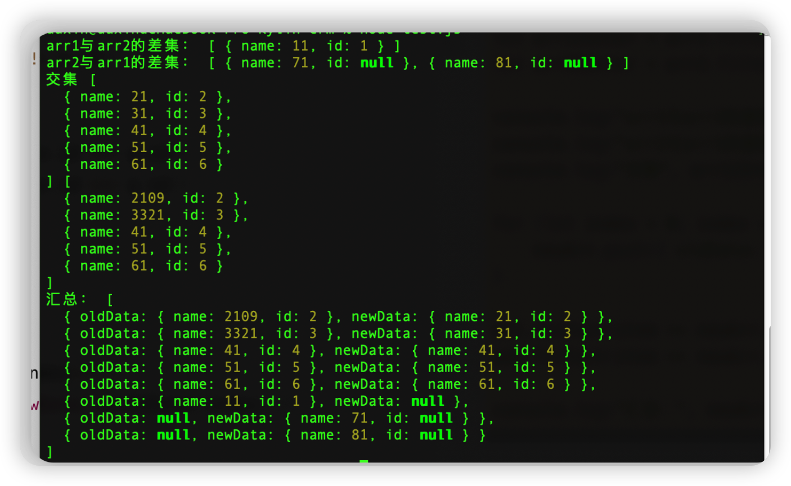

在集合A和集合B中，属于集合A，同时也属于集合B的元素组成的集合，就是**交集**。

在A中所有不属于集合B元素，组合成集合，就是**差集**。

那么在平时的开发中，如何使用差集和交集来解决问题呢？

现在有这样的场景，在一个表格编辑数据后，要把编辑前的数据和修改后的数据，汇总。

源数据为：

```javascript
const arr1 = [{ name: 11, id: 1 }, { name: 21, id: 2 }, { name: 31, id: 3 }, { name: 41, id: 4 }, { name: 51, id: 5 }, { name: 61, id: 6 }];
```

在页面中表现为：


现在删除第一行数据，第二行的名字改为2109，第三行的名字改为3321；然后新增两行，分别为：71、81。

数据如下：

```javascript
const arr2 = [{ name: 2109, id: 2 }, { name: 3321, id: 3 }, { name: 41, id: 4 }, { name: 51, id: 5 }, { name: 61, id: 6 }, { name: 71, id: null }, { name: 81, id: null }];
```

页面为：


由于是新增数据还没有提交保存，所以对应的序号，也就是ID为空。

最终想要的效果图下图所示：


需要在表格中体现那些数据是修改、删除、新增，哪些数据没有改变。

 思路：

1. 源数据是一个数组arr1；
2. 修改后的数据也是一个数组arr2；
3. 删除的数据，在数组arr1中有，数组arr2中没有；
4. 修改的数据，在数组arr1和arr2中，都找对应的ID；
5. 新增的数据，只出现在数组arr2中。

那么数组arr2与数组arr1的差集，就是新增的数据：

```javascript
let add = arr2.filter(x => arr1.every(y => y.id != x.id))
```

数组arr1与数组arr2的差集，就是删除的数据：

```javascript
let del = arr1.filter(x => arr2.every(y => y.id != x.id))
```

修改或者没有修改数据，就是数组arr1和数组arr2的交集：

```javascript
// arr1、arr2的交集
let arr12Inter = arr1.filter(x => arr2.some(y => x.id === y.id))
let arr21Inter = arr2.filter(x => arr1.some(y => x.id === y.id))
```

最后一步，就是组合所有的差集、交集，汇总成新的数组：

```javascript
for (let index = 0; index < arr12Inter.length; index++) {
    newArr.push({ oldData: arr21Inter[index], newData: arr12Inter[index] })
}

del.forEach(item => newArr.push({ oldData: item, newData: null }))
add.forEach(item => newArr.push({ oldData: null, newData: item }))
```

完整代码：

```javascript
const arr1 = [{ name: 11, id: 1 }, { name: 21, id: 2 }, { name: 31, id: 3 }, { name: 41, id: 4 }, { name: 51, id: 5 }, { name: 61, id: 6 }];

const arr2 = [{ name: 2109, id: 2 }, { name: 3321, id: 3 }, { name: 41, id: 4 }, { name: 51, id: 5 }, { name: 61, id: 6 }, { name: 71, id: null }, { name: 81, id: null }];
let newArr = [];
// arr1——>arr2的差集:删除
let del = arr1.filter(x => arr2.every(y => y.id != x.id))

// arr2——>arr1的差集：新增
let add = arr2.filter(x => arr1.every(y => y.id != x.id))

// arr1、arr2的交集：修改
let arr12Inter = arr1.filter(x => arr2.some(y => x.id === y.id))
let arr21Inter = arr2.filter(x => arr1.some(y => x.id === y.id))

console.log("arr1与arr2的差集：", del)
console.log("arr2与arr1的差集：", add)
console.log("交集", arr12Inter, arr21Inter)

for (let index = 0; index < arr12Inter.length; index++) {
    newArr.push({ oldData: arr21Inter[index], newData: arr12Inter[index] })
}

del.forEach(item => newArr.push({ oldData: item, newData: null }))
add.forEach(item => newArr.push({ oldData: null, newData: item }))

console.log("汇总：", newArr)
```



使用交集、差集，仅仅是一种方式！