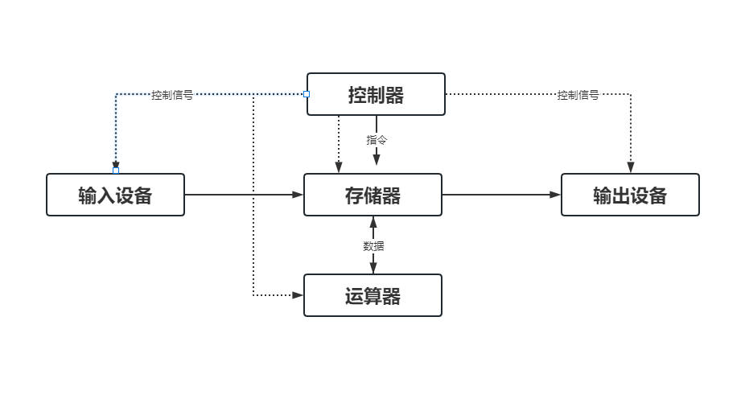
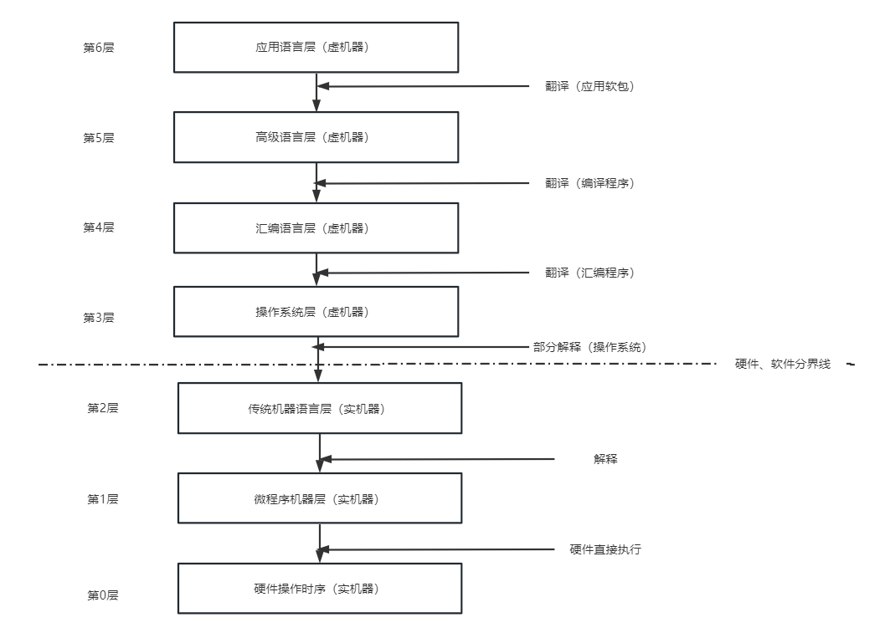
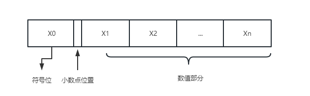
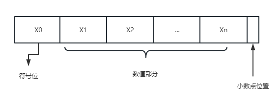
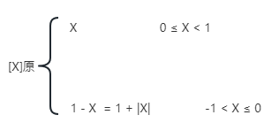
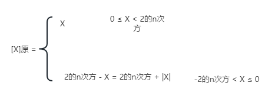
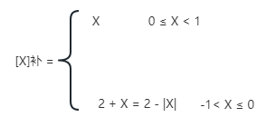
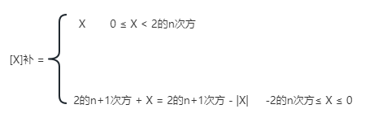
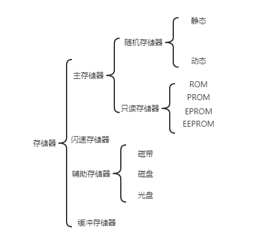

---

## 计算机概论

---

### 计算机的发展历程

1. 1946年第一台点子数字积分计算机【电子管时代】，逻辑元件采用电子管；使用机器语言进行编辑；主存用延迟或者磁鼓存储信息，容量极小，体积大，成本高，运算速度低。
2. 晶体管时代【1958年~1964年】，逻辑元件采用晶体管，运算速度达到了每秒几万到几十万；主存采用磁芯存储器，软件开始使用高级语言开发
3. 中小规模的集成电路时代【1965年~1972年】，逻辑元件采用了中小规模的集成电路；半导体存储器开发取代了磁芯存储器；高级语言和操作系统得到迅速发展。开始有了分时操作系统。
4. 超大集成电路时代【1972年至今】，逻辑元件采用了大规模集成电路和超大规模集成电路，产生可微处理器，半导体存储完全取代了磁芯存储器。

### 计算机硬件

计算机硬件由运算器、存储器、控制器、输入设备和输出设备组成：

#### 运算器

 运算器是在控制器的指令下，对数据或者信息进行处理和运算，这就是算术逻辑运算单元

#### 控制器

控制器是计算机的控制中心，用来实现计算机本身运算过程的自动化。它控制计算机各个部件按照指令功能进行所需的操作。

#### 存储器

存储器是计算机用来存储程序和数据的记忆部件。是计算机各种信息数据存放和交流中心。

存储器是在控制器的指挥下按照指定的地址存入或者取出数据。

（1）、主存【内存】是由CPU直接访问的存储器，存放着正在运行的程序和数据，也可以存放计算结果或者中间结果。因为主存直接和运算器、控制器交换数据，所以要求存取速度快。现在计算机的主存采用了大规模集成电路制作成的半导体存储器，它的优点是存储容量大、体积小、重量轻、存取 速度快。

（2）、高速缓存【Cache】，存取速度比主存快，但是CPU内部的寄存器慢，容量小，经常被放置在CPU和主存之间。

（3）、外存是计算机的外围设备，用来存储大量暂时不需要参与计算的数据或者程序。所以允许存取速度慢。比如磁盘存储器、磁带存储器、光盘存储器。

#### 输入和输出设备

输入和输出设备是计算机和外界联系的桥梁。

输入设备：键盘、鼠标、扫描仪等等。
输出设备：显示器、打印机、绘图仪等等。

#### 总线

总线是一组由多个功能部件共享的公共信息传送线路。比如：

总线一般包含3组：地址总线、数据总线和控制总线。

地址总线是单向的，CPU用它来传送主存单元地址或者输入/输出端口地址。

数据总线主要是用于传送各个大部分部件之间的数据信息。比如数字、命令字和状态字。

控制总线是用于传送控制信号和时序信号。

---

### 计算机软件

---

计算机软件是计算机系统的重要组成部分，软件将各种计算机的指令组合起来，让计算机硬件部分能够正常工作。

#### 计算机软件分类

软件分为系统软件和应用软件。

系统软是一组保证计算机系统高效、正确运行的基础软件，一般作为操作系统资源提供给用户使用的。比如操作系统、语言处理系统，数据管理系统、分布式软件系统、网络软件系统。

注意：数据库管理系统和数据库系统是有区别的：数据库管理系统是用户和操作系统之间的一层数据管理软件；数据库系统是计算机系统中引入数据库后的系统。

应用软件：用户为了解决某一个应用领域的问题而开发的程序，包括了科学计算类软件、工程设计类软件、数据统计与处理软件、情报检索软件、企业管理软件等等。

#### 程序设计语言

计算机的程序设计语言分为机器语言、汇编语言和高级语言

##### 机器语言

极其语言是一种二进制语言，使用二进制来描述机器指令。机器语言是计算机唯一能够识别、直接执行的一种一种语言，所以运行速度很快，但是机器语言编写的程序不直观、难懂、难写、难以修改和维护。

另外机器语言是每一种计算机所固有的，不同类型的计算机，它的指令有所不同，那么针对某一种类型计算机编写的程序就不能再另一种类型计算机上运行。也就是机器语言程序没有通用性。

##### 汇编语言

汇编语言和机器语言基本上是一一对应的，在表示方法上有所改变，汇编语言使用了一种助记符来代替操作码，用符号来表示操作数地址。

助记符通常是指令功能英文单词的缩写，比如：ADD表示加法。

汇编语言也机器语言一样，也是面向机器的程序设计语言，通用性很差。所以汇编语言也是低级语言。

##### 高级语言

高级语言是为了让程序语言更加贴近人类的自然语言，同时又不依赖于计算机硬件。比如C语言、C++、Java等等。

### 计算机系统层次结构

计算机系统分层次大致如下图：

### 计算机性能指标

1. 主频：CPU工作节奏是通过时钟来控制的，时钟产生的固定频率就是CPU的主频，单位是兆赫兹(MHz)、GHz。
2. CPU时时钟周期是主频的倒数
3. CPI是执行一条指令需要的周期，计算公式是：CPI= 某段程序执行需要的CPU时钟周期 / 程序包含的指令条数
4. CPU执行时间，就是运行一个程序所花费的时间，计算公式：` T =  执行程序的指令总数 *  CPI  * CPU时时钟周期 `

5. 运算速度：每秒执行多少条指令
6. 基本字长：直接参与运算的数据的二进制位数，它决定了寄存器、ALU、数据总线的位数，直接影响到硬件的造价。位数越多精度越高。一般字长都是字节的1、2、4、8倍。微型计算机的字长为8位、16位、32位、64位。
7. 主存容量：主存中能够存储的信息总字节数。【字节作为一个单位来处理二进制的数位，以8个二进制位作为一个字节，1024B = 1KB】
8. 主存存取周期：就是连续两次访问主存所允许的最小时间间隔。

---

## 数据表示

---

数据是计算机加工处理的对象，分为数值数据和非数值数据

数值数据就是1233，具有“量的概念”

非数值数据，比如字母和符号，

数据在计算机中，都是以二进制数码表示的。

### 编码

将信息从一种形式转化为另一种形式的符号系统，一般是选用少量最简单的基本符号集合一定的组合规则，来表示大量复杂多样的信息。

### 字符和字符串

字符是按照一定规则使用一组二进制编码来表示。比如ASCII码

### 字符串的存放

字符串就是一串字符，它们占用主存中连续的多个字节，每一个字节存储一个字符。

### 汉字编码

汉字编码分为机内码和机外码

机内码：在计算机内部使用的二进制数表示的汉字编码，用于在计算机内部存储、交换、处理加工汉字信息。

机外码：不再计算机内部使用的汉字编码，主要是汉字输入码和汉字字模码

### 校验码

能够自动发现或者纠错的数据编码。常用三种校验码：奇偶校验码、海明校验码和循环冗余校验码。

### 真值和机器数

带有正负号的数称为真值；采用数的符号和数值一起编码的方法来表示数据，比如用0表示正，用1表示负，那么0101就是5。这样的数字就是机器数。

通常有原码、反码、补码和移码表示法。

### 定点数的表示

在计算机中，小数点是按照约定的方式标出。有两种方式：

1. 约定所有数据的小数点位置固定不变，就是定点表示；
2. 约定小数点的位置是可以浮动的，就是浮点表示

#### 无符号数和有符号数

无符号数：对于字长为n位的无符号数的表示范围：0~2的n-1次方

有符号数：将数的符号码化，一般规定二进制的最高位为符号位，最高位是0的话，那么该数是正数；最高位是1表示为负数。

#### 机器数的定点表示

1. 定点小数：就是纯小数，约定小数点固定在机器数数值位的左边，符号位的右边，那么机器数表示纯小数。比如：

2. 定点整数，就是纯整数，约定小数点固定在最低位的右边，机器数表示纯整数。如下图所示：

#### 数的机器码表示

1、原码表示：比较简单、直观的机器数表示方法，用机器数的最高位表示符号位，其余的表示数的绝对值。分为两种情况：

（1）当X为纯小数时，X= ±0.x1x2x3···xn，那么原码定义为：

（2）当X为纯整数时，X= ±x1x2x3···xn，那么原码定义为：

2、补码表示法，利用模运算的补数表示负数。

（1）当X为纯小数的时，X=±0.x1x2x3···xn，那么补码表示为：

（2）当X为纯整数时，X= ±x1x2x3···xn，那么补码定义为：

3、反码表示法。一般是用来作为原码求补码或者是补码求原码的中间过渡。规则如下：

（1）符号位：0表示证号“+”，1表示负号“-”；

（2）数值部分：正数，数值部分和真值部分形式相同；负数，将真值的数值部分按照位取反。

4、移码表示法，用来表示浮点数的阶码，只能表示整数，移码定义为：`X移 = 2的n次方 + X， -2的n次方 ≤ X < 2的n次方【机器字长为n+1】`。

#### 浮点数的表示格式

浮点数是指小数点的位置随着比例因子的不同而改变。

---

## 数据运算和运算器

---

### 定点运算
---

1、移位运算，根据操作对象的不同，分为算术移位运算和逻辑移位运算。

（1）算术移位运算，操作对象是有符号数的，符号数有原码、反码、补码等等多种表示法。在左移或者右移的时候，空位所补数字与表示法以及数据的符号有关系。

| 数据的符号 | 码制 | 填补代码 |
|----|----|----|
| 正数 | 原码、反码、补码 | 0
|负数 | 原码 | 0 |
|负数 | 反码 | 1 |
|负数 | 补码 | 左移补0 或者 右移补1|

（2）逻辑移位运算，操作数当做是无符号数看待，运算规则为：逻辑左移时，最高位 丢失，低位补0；逻辑右移，低位丢失，高位补0。

（3）循环移位运算，将被移位数据的左右两端连接起来，形成闭合的以为环路

### 加减法运算
---

1、原码加减法运算，运算规则如下：

（1）加法：先判断符号位，如果符号位相同，绝对值相加；如果符号位不同，那么绝对值大数减去绝对值小的数。

（2）减法：首先将减法符号位取反，然后将减数与符号位取反后的减数按照原码加法规则进行运算。

2、补码加减运算：

（1）补码加法运算：`[X]补 + [Y]补 = [X+Y]补`

（2）补码减法运算：`[X-Y]补 = [X]补 - [Y]补 = [X]补 + [-Y]补`

3、溢出判断，当就结果超出了数的表示范围，就是溢出。大于机器数所表示的最大正数称为上溢；小于机器所表示的最小负数，称为下溢出。

补码定点加减法运算溢出判断的方法有3种：

（1）直接判断：同号补码相加，结果符号位与加数相反，或者异号补码相减，结果符号位与减数相同，表示溢出。

（2）进位判断：根据最高数值位产生的进位与符号位产生的进位是否相同来判断，当相同时，说明没有溢出，否则表示溢出。

（3）变形补码：也就是模4补码，采用双符号为表示补码：

|双符号|结果|
|---|---|
| 00 | 正|
|01 |上溢 |
|10 | 下溢 |
|11 | 负 |

### 乘法运算
---

在计算机中的乘法运算是通过累加和右移操作来实现的。由于机器数的不同，分为原码一位乘法运算和补码一位乘法运算

1、原码一位乘法运算：运算规则如下：

（1）用被乘数和乘数的数值位部分进行运算，设置部分积初始值为0

（2）若乘数Y的最低位y0 = 0，则将上一次的部分积右移一位，得到新的部分积；
若乘数Y的最低位y0=1，则将上一次的部分积与被乘数相加，然后右移一位，得到新的部分积；乘数Y右移一位。

（3）重复步骤（2）n遍，n是被乘数和乘数数值位的位数。最后得到的部分积就是乘积的数值部分。

（4）符号位单独进行计算，同号相乘，乘积为正，异号相乘乘积为负。

2、补码一位乘法运算，如果参与运算的是两个n位的定点补码数，则乘积为2n的补码数。其中各自包含了一位符号位。

运算规则如下：

（1）参与运算的数都是用补码表示的，符号位一同参与运算，得到的结果也是补码。

（2）乘数Y的末尾增设一位附加位y-1，初始值为0，部分积的初始值为0.

（3）根据乘数Y的最低两位y0y-1的值，进行相应的操作。

（4）重复（3）n遍，最后得到的部分积就是运算结果。

补码一位乘法运算的操作：

|y0y-1|操作|
|---|---|
|00|上次部分积右移一位；乘数Y循环右移一位，y0 ——> y-1|
|01|上次部分积加被乘数X，右移一位；乘数Y循环右移一位，y0——>y-1|
|10|上次部分积减被乘数X，右移一位，乘数Y循环右移一位，y0——>y-1|
|11|上次部分积右移一位，乘数Y循环右移一位，y0——>y-1|

---
### 除法运算
---

在计算机中，除法运算转为累加和左移（逻辑左移）操作。

1、原码除法运算————不恢复余数法。

2、补码除法运算————加减交替法。

---
## 存储系统
---

存储器的功能就是存放指令和数据，让计算机具有记忆的能力，具备的自动操作的能力。分类如下图所示：

主存和CPU通过总线来连接，

---
## 指令系统
---

计算机的指令是包含了操作类型、操作数、操作数存储位置、操作结果的存储位置。

指令的格式的是二进制结构形式。

一条指令是由操作码字段（OP）和地址码字段（A）组成；

操作码字段OP，是指令应该执行什么样的操作和具有什么样的功能；

### 操作码
---

操作码可以识别指令、了解指令功能、区分操作数地址内容的组成和使用方法等等这些信息。

指令系统中的每一条指令都有唯一确定的操作码。

不同的指令的操作码，使用了不同编码来表示。

操作码的编码方式通常有三种：

1. 等长编码法：指令系统中所有的指令长度都一样，占用二进制位数相同；
2. 哈夫曼编码法：使用了哈夫曼压缩的概念，指令使用频率较高的操作码，用短的二进制位来表示；使用频率较低的操作码，用较长的二进制位来表示。
3. 扩展编码法：将操作码扩展成几种长度不同的编码。比如等长扩展编码和不等长扩展编码。

### 地址码
---

地址码就是操作数的存储位置，指令中可以有0个、1个、2个、3个或者多个地址码。

1. 零地址指令格式：指令中只有操作码OP，没有地址码；
2. 一地址指令格式：指令中只有一个地址码A1；
3. 二地址指令格式：指令中有两个地址码A1、A2；
4. 三地址指令格式：指令中有两个地址码A1、A2、A3；
5. 多地址指令格式：指令中有两个地址码A1、A2、A3、A4；

## 中央处理器CPU
---

### CPU的组成和功能

CPU功能大概分为5个方面：

1. 指令控制：完成获取指令、分析指令和执行指令的操作，也就是程序的顺序控制。
2. 操作控制：一条指令往往是由多个操作信号的组合来实现的。CPU管理并且生产从主存取出的每一条指令的操作信号，把各种操作信号送到相应的部件。
3. 时间控制：对各种操作实施时间上的定时，计算机中的各种类型指令的操作信号已经指令的整个执行过程都受到时间的限制；
4. 数据加工：对数据进行算数运算和逻辑运算；
5. 终端处理：对计算机中运行过程中出现的异常情况和特殊请求进行处理。

CPU是由运算器、控制器和Cache三大部分组成的。

控制器：控制整台计算机的各种功能部件的协作、自动执行计算机程序的部件。控制器的主要功能：

1. 从指令Cache中取出一条指令，并且指出下一条指令在Cache中的位置；
2. 对指令进行译码或者测试，并产生相应的操作控制信号，以便启动规定的操作；
3. 指挥并且控制CPU、数据Cache和输入/输出设备之间的数据流动方向。

运算器：是由算术逻辑单元ALU、累加寄存器AC、数据缓冲寄存器DR和程序状态寄存器PSW组成，寄存器是数据加工部件。主要的功能：

1. 执行所有的算术运算；
2. 执行所有的逻辑运算，并且进行逻辑测试。

## 总线系统
---

总线就是计算中连接各种部件的线路，是信息源传输信息到多个目的地的数据通路。

总线分类：

1. 片内总线：芯片内部的总线，CPU内部连接各寄存器以及运算器部件的总线；
2. 系统总线：计算机各种高速部件【也就是主板上各个部件】之间的信息传输线路；
3. I/O总线：通信总线或者外部总线，用于CPU和中低速的外围设备、计算机系统之间或者计算机与其他系统之间的通信。

## 外围设备
---

计算机与外部环境提供通信手段的设备，比如鼠标、键盘、显示器等等